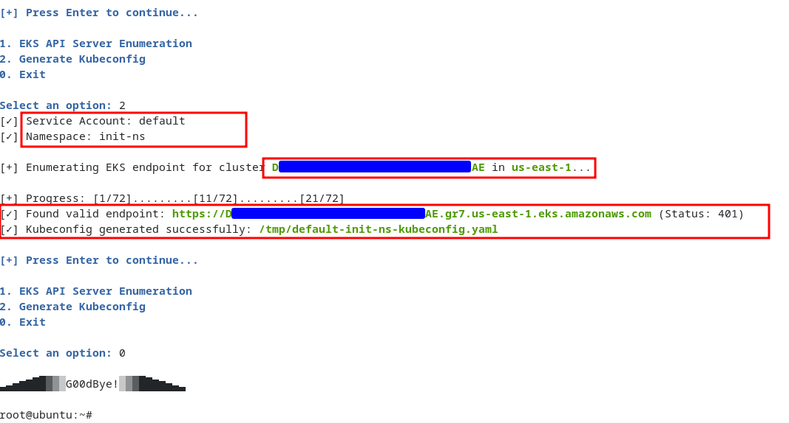

<p align="center">
  
</p>

# Intro
**EKS Holmes** is a post-exploitation tool I wrote to enumerate the EKS API Server URLs. By default this URL is not exposed to the workloads and thus has to be enumerated. It's designed to be executed inside an EKS pod, where it will decode the K8s JWT token & use it to enumerate the EKS API Server URL. The enumeration is performed based on a trial & error method which first crafts an URL from parameters and then sends unauthenticated HTTP request to it. If it receives Response Code 401 from any of the URL, that will be the correct one and all others will return not found.


# Features
As of now, EKS Holmes supports the identification of EKS API Server URL & generating the Kubeconfig for the ServiceAccount running the compromised workload.

 
# Usage 
The easiest way to use **EKS Holmes** is to head to the releases section & pull the compiled binary directly into the EKS pod. 
In case you're not willing to do that, please follow below steps to build it for yourself. 
```sh
git clone https://github.com/wand3rlust/EKSHolmes.git
cd EKSHolmes

# Please ensure you're using Golang verison 1.25 or else modify the **go.mod** file for your version. 
go build

# Then transfer the compiled binary to the EKS pod & execute it there.
```

# Demo




# Future Roadmap
- [ ] Adding more post-exploitation features including permisions enum & cluster enum.


# Contributing
To contribute simply fork this repo, make changes and create a pull request.


# Support
If you like this tool please consider giving a :star:.
